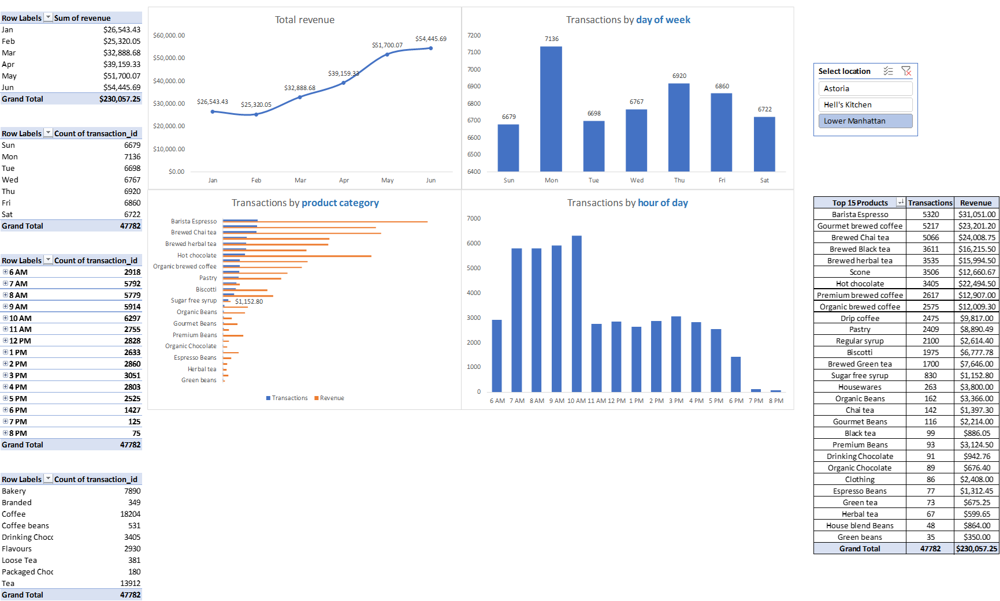

&nbsp;

&nbsp;

An interactive dashboard to explore and analyze coffee shop sales. Transaction records from a fictitious coffee shop in New York City.

## Objectives

The project had the following goals:

- Prepare the data for analysis: conduct basic Q&A and profiling, add calculated dates and time fields
- Explore the data with pivot tables: slide and dice the coffee shop data with Excel PivotTables, and create views to analyze time series and product-level trends
- Build a dynamic dashboard: visualize the data with Pivot Charts, design an interactive dashboard, and identify insights and recommendations for the coffee shop.
